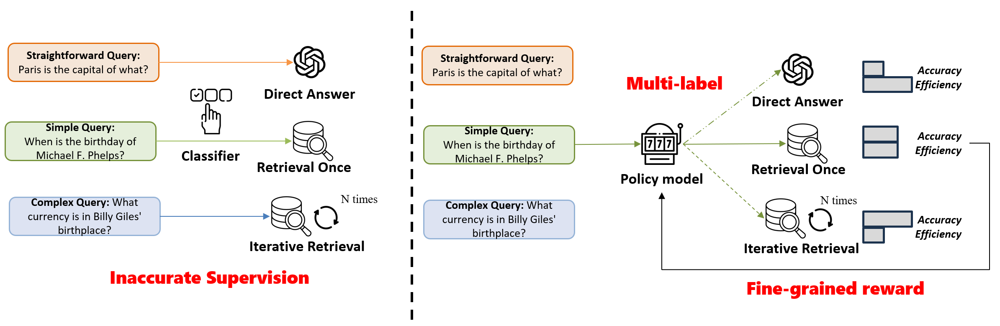

# MBA-RAG: a Bandit Approach for Adaptive Retrieval-Augmented Generation through Question Complexity

## Abstract

Retrieval Augmented Generation (RAG)  has proven to be highly effective in boosting the generative performance of language model in knowledge-intensive tasks. However, existing RAG framework either indiscriminately perform retrieval or rely on rigid single-class classifiers to select retrieval methods, leading to inefficiencies and suboptimal performance across  queries of varying complexity.
To address these challenges, we propose a reinforcement learning-based framework that dynamically selects the most suitable retrieval strategy based on query complexity.
Our approach leverages a multi-armed bandit algorithm, which treats each retrieval method as a distinct ``arm'' and adapts the selection process by balancing exploration and exploitation. Additionally, we introduce a dynamic reward function that balances accuracy and efficiency, penalizing methods that require more retrieval steps, even if they lead to a correct result. 
Our method achieves new state of the art results on multiple single-hop and multi-hop datasets while reducing retrieval costs. 



On the left, the AdaptiveRAG pipeline relies on an inaccurate heuristic approach to assign queries of different complexities to a single generation process. On the right, we propose an MBA-RAG framework that allows the model to explore the merits of different generation methods and rewards it based on fine-grained assessments of generation quality and cost.

## Datasets
* You can download multi-hop datasets (MuSiQue, HotpotQA, and 2WikiMultiHopQA) from https://github.com/StonyBrookNLP/ircot.
```bash
# Download the preprocessed datasets for the test set.
$ bash ./download/processed_data.sh
# Prepare the dev set, which will be used for training our query complexity classfier.
$ bash ./download/raw_data.sh
$ python processing_scripts/subsample_dataset_and_remap_paras.py musique dev_diff_size 500
$ python processing_scripts/subsample_dataset_and_remap_paras.py hotpotqa dev_diff_size 500
$ python processing_scripts/subsample_dataset_and_remap_paras.py 2wikimultihopqa dev_diff_size 500
```

## Train and evaluate Multi-arm bandit for MBA-RAG

```bash
cd MAB/
bash train_single.sh
bash train_multiple.sh

```

## Acknowledgement
We refer to the repository of [AdaptiveRAG](https://github.com/starsuzi/Adaptive-RAG) as a skeleton code.